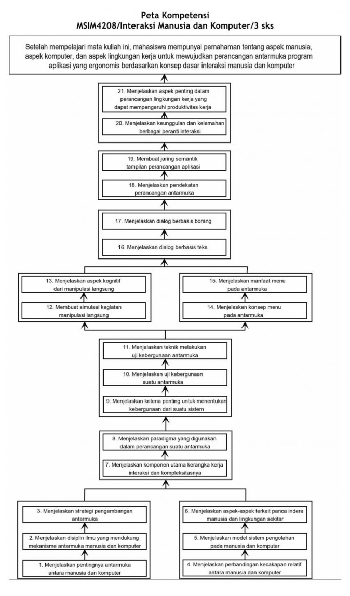

# Interaksi Manusia dan Komputer

Mata kuliah MSIM4208 Interaksi Manusia dan Komputer yang berbobot 3 (tiga) SKS ini berisi paparan tentang aspek manusia, aspek komputer, dan aspek lingkungan kerja, terutama yang berkaitan dengan pembuatan antarmuka (interface) program aplikasi dan pencapaian kondisi lingkungan kerja yang aman. Ketika Anda menggunakan komputer, barangkali Anda tidak menyadari bahwa saat itu Anda sedang melakukan dialog dengan komputer. Ketika Anda memberikan suatu perintah, komputer akan mengerjakan perintah tersebut dan menampilkan tanggapannya di layar tampilan (monitor). Pada saat ini terjadilah suatu dialog antara Anda (manusia) dengan komputer (mesin). Di sinilah muncul sebuah disiplin ilmu di dalam Ilmu Komputer yang disebut Interaksi Manusia dan Komputer (Human Computer Interaction). Aspek penting yang dipelajari dalam Interaksi Manusia dan Komputer antara lain adalah aspek manusia, aspek komputer, dan aspek lingkungan kerja atau yang lebih dikenal dengan sebutan ergonomis.

## Modul

Secara rinci, konsep dan prinsip Interaksi Manusia dan Komputer yang akan Anda pelajari dalam mata kuliah ini meliputi hal-hal berikut.

1. Antarmuka Manusia dan Komputer
2. Faktor Manusia
3. Kerangka Kerja dan Paradigma Interaksi
4. Kebergunaan
5. Manipulasi Langsung
6. Antarmuka Berbasis Menu
7. Dialog Berbasis Teks dan Pengisian Borang
8. Perancangan Tampilan
9. Peranti Interaksi dan Lingkungan Fisik

Kesembilan konsep di atas saling terkait satu sama lain, sehingga Anda harus mempelajarinya secara sistematis dan komprehensif. Anda diharapkan mempelajari semua materi dengan seksama, agar Anda dapat meraih capaian pembelajaran umum mata kuliah ini, yaitu mempunyai pemahaman tentang aspek manusia, aspek komputer, dan aspek lingkungan kerja untuk mewujudkan perancangan antarmuka program aplikasi yang ergonomis berdasarkan konsep dasar interaksi manusia dan komputer.

## Capaian Pembelajaran

Untuk mendapatkan capaian pembelajaran umum mata kuliah tersebut, secara lebih rinci, Anda diharapkan dapat meraih capaian pembelajaran khusus sebagai berikut, yaitu mampu:

1. menjelaskan pentingnya antarmuka antara manusia dan komputer;
2. menjelaskan disiplin ilmu yang mendukung mekanisme antarmuka manusia dan komputer;
3. menjelaskan strategi pengembangan antarmuka;
4. menjelaskan perbandingan kecakapan relatif antara manusia dan komputer;
5. menjelaskan model sistem pengolahan pada manusia dan komputer;
6. menjelaskan aspek-aspek terkait panca indera manusia dan lingkungan sekitar;
7. menjelaskan komponen utama kerangka kerja interaksi dan kompleksitasnya;
8. menjelaskan paradigma yang digunakan dalam perancangan suatu antarmuka;
9. menjelaskan kriteria penting untuk menentukan kebergunaan dari suatu sistem;
10. menjelaskan uji kebergunaan;
11. menjelaskan teknik melakukan uji kebergunaan;
12. membuat simulasi kegiatan manipulasi langsung;
13. menjelaskan aspek kognitif dari manipulasi langsung;
14. menjelaskan konsep menu pada antarmuka;
15. menjelaskan manfaat menu pada antarmuka;
16. menjelaskan dialog berbasis teks;
17. menjelaskan dialog berbasis borang;
18. menjelaskan pendekatan perancangan antarmuka;
19. membuat jaring semantik tampilan perancangan aplikasi;
20. menjelaskan keunggulan dan kelemahan berbagai peranti interaksi;
21. menjelaskan aspek penting dalam perancangan lingkungan kerja yang dapat mempengaruhi produktivitas kerja.

Sistematika dan ruang lingkup materi yang dibahas dalam mata kuliah Interaksi Manusia dan Komputer ini dapat Anda lihat pada peta kompetensi mata kuliah berikut.

## Peta Kompetensi

MSIM4208/Interaksi Manusia dan Komputer/3 sks

