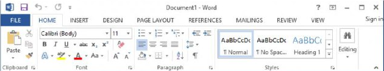
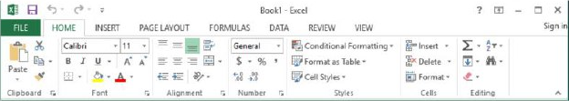
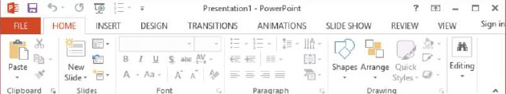
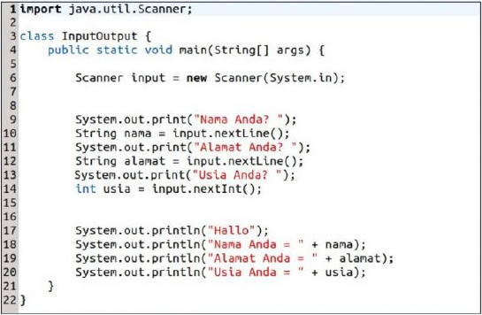
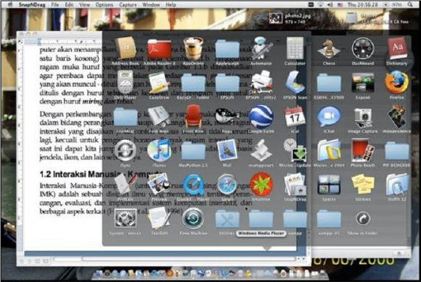

# Antarmuka Manusia dan Komputer

Prinsip dasar sebuah sistem komputer adalah masukan, proses, keluaran (input, process, output). Manusia sebagai pengguna (user) komputer, memberikan data masukan kepada komputer. Data masukan biasanya berupa angka maupun deretan karakter. Data masukan ini kemudian diolah atau diproses oleh komputer menjadi keluaran yang diinginkan atau diharapkan oleh pengguna.

Ketika seseorang bekerja dengan sebuah komputer, secara disadari atau tidak, dia akan melakukan interaksi dengan komputer menggunakan cara-cara tertentu. Interaksi terjadi ketika pengguna memasukkan data, yang kemudian akan ditanggapi oleh komputer dengan menampilkan suatu keluaran ke layar tampilan atau ke pencetak. Dari jargon “masukan, proses, keluaran” di atas, pengguna memang tidak tahu menahu (atau tidak ingin tahu) dengan proses yang sesungguhnya terjadi di dalam sistem komputer. Dengan kata lain, lewat masukan dan keluaranlah pengguna dan komputer saling berinteraksi.

## ANTARMUKA MANUSIA - KOMPUTER

Interaksi antara pengguna dan komputer dapat terjadi jika tersedia media interaksi. Media ini diperlukan agar pengguna dan komputer dapat saling berinteraksi. Media interaksi ini diwujudkan dalam bentuk antarmuka (interface). Antarmuka yang dirancang dengan baik membuat pengguna merasakan keramahan sistem komputer yang digunakannya. Contoh yang sering kita jumpai adalah antarmuka dari paket Microsoft Office. Antarmuka ini sangat membantu pengguna mengenal sistem dengan cepat.

Pada Gambar 1.1, 1.2, dan 1.3 terlihat konsistensi dalam tampilan dan fitur paket Microsoft Office. Konsistensi merupakan salah satu faktor yang diperlukan untuk membuat antarmuka yang user-friendly. Setelah pengguna mempelajari salah satu aplikasi, maka pengguna dapat mempelajari dengan mudah aplikasi lainnya. Pengguna tidak perlu mempelajari antarmuka dari awal lagi, namun hanya mempelajari fitur yang dimaksudkan untuk aplikasi tertentu karena hal lainnya telah dia pelajari.



Gambar 1.1
Antarmuka MS Word



Gambar 1.2
Antarmuka MS Excel



Gambar 1.3
Antarmuka MS PowerPoint

Interaksi manusia dan komputer juga dapat digambarkan melalui contoh program sederhana. Pada Gambar 1.4 diberikan contoh sederhana yang ditulis menggunakan bahasa pemrograman Python. Dalam program tersebut, dapat dilihat contoh sederhana interaksi, yaitu ketika pengguna menerapkan statemen `raw_input` dan/atau `input`. Ketika komputer mengolah statemen ini, komputer meminta pengguna untuk memasukkan data ke komputer. Selanjutnya, statemen `print` digunakan untuk mencetak hasil proses yang telah dikerjakan oleh komputer. Gambar 1.4 menunjukkan contoh penggunaan statemen `raw_input`, input, dan print pada bahasa pemrograman Python yang digunakan untuk meminta masukan dari pengguna dan mencetak keluaran hasil eksekusi program. Nomor baris yang dituliskan pada Gambar 1.4.a hanya digunakan untuk mempermudah penulis menjelaskan satu atau sekelompok statemen pada program yang dimaksud.

Program pada Gambar 1.4.a mempunyai dua buah statemen `raw_input`, sebuah statemen `input`, dan lima buah statemen `print` yang salah satunya tidak diikuti apapun (baris 13). Variasi statemen `print` ini fungsinya sama, yakni untuk mencetak suatu keluaran hasil eksekusi program. Tetapi, dapatkah Anda membedakan kedua variasi ini? Statemen `print` yang pertama (baris 13) digunakan untuk mencetak sebuah baris kosong di antara kelompok pengisian data dan pencetakan hasil (lihat Gambar 1.4.b). Statemen  `print` yang lain digunakan untuk mencetak kata `Hallo` dan kata-kata yang lain (baris 14 dan seterusnya).

```txt
[ 1] #------------------------------------------------- 
[ 2] # Contoh penggunaan statemen masukan dan keluaran 
[ 3] #------------------------------------------------- 
[ 4] #!/usr/local/bin/python 
[ 5] # -*- coding: utf-8 -*- 
 
[ 7] #--- meminta masukan dari pengguna --- 
[ 8] nama = raw_input('Nama Anda? ') 
[ 9] alamat = raw_input('Alamat Anda? ') 
[10] umur = input('Usia Anda? ') 
 
[12] #--- mencetak hasil --- 
[13] print 
[14] print 'Hallo,' 
[15] print 'Nama Anda:', nama 
[16] print 'Alamat Anda:', alamat 
[17] print 'Usia Anda:', umur
```

[Gambar 1.4.a](../media/Gambar-1.4.a.png)

```txt
Nama Anda? Insap 
Alamat Anda? Yogyakarta 
Usia Anda? 47 
 
Hallo, 
Nama Anda: Insap 
Alamat Anda: Yogyakarta 
Usia Anda: 47 
```

[Gambar 1.4.b](../media/Gambar-1.4.b.png)

Contoh Program Sederhana Python

Perbedaan antara statemen `raw_input` dengan `input` adalah bahwa dengan `raw_input` pengguna diperbolehkan memasukkan sembarang karakter, sementara pada `input`, pengguna hanya diperbolehkan untuk memasukkan data angka. Jika dilanggar, maka interpreter Python akan menampilkan pesan salah.

Ketika program dijalankan, maka pada layar pertama kali akan terlihat pesan `Nama Anda?` Dengan pesan ini, komputer meminta pengguna memasukkan sembarang kombinasi karakter yang akan dianggap atau diterima sebagai nama pengguna. Setelah pengguna memasukkan namanya atau sembarang kombinasi karakter bebas, pesan kedua, yaitu `Alamat Anda?` akan muncul. Dalam hal ini, komputer kembali meminta pengguna untuk memasukkan data yang akan dianggap sebagai alamat pengguna. Setelah pengguna memasukkan alamatnya, selanjutnya pesan `Usia Anda?` akan muncul. Di sini, pengguna diminta memasukkan sembarang bilangan yang akan dianggap atau diterima sebagai usia pengguna. Setelah pengguna mengisikan nilai untuk ketiga data yang diminta, komputer akan menampilkan hasilnya, yakni lima baris terakhir (termasuk satu baris kosong) yang terlihat pada Gambar 1.4.b. Penggunaan jenis huruf yang berbeda pada Gambar 1.4.b dimaksudkan agar pembaca dapat melihat perbedaan antara prompt/pesan yang akan muncul, yang ditulis dengan huruf miring, dan isian oleh pengguna, yang ditulis dengan huruf tebal, dan keluaran dari program, yang ditulis dengan huruf miring dan tebal.

Contoh yang sama dengan program pada Gambar 1.4, namun menggunakan bahasa pemrograman Java dapat dilihat pada Gambar 1.5.



Gambar 1.5
Contoh Program Sederhana Java

Dalam program ini, contoh sederhana interaksi, yaitu ketika pengguna menerapkan statemen `input.nextLine()` atau `input.nextInt()` dari baris 9 sampai baris 14 untuk memasukkan input yang diinginkan oleh user. Ketika komputer mengolah statemen ini, komputer meminta pengguna untuk memasukkan data ke komputer. Selanjutnya, statemen `System.out.println()` digunakan untuk mencetak hasil proses yang telah dikerjakan oleh komputer. Gambar 1.5 menunjukkan contoh penggunaan statemen `input.nextLine()`, `input.nextInt()`, dan `System.out.println()` pada bahasa pemrograman Java yang digunakan untuk meminta masukan dari pengguna dan mencetak keluaran hasil eksekusi program. Nomor baris yang dituliskan pada Gambar 1.5 hanya digunakan untuk menjelaskan statemen pada program yang dimaksud.

Dengan perkembangan teknologi komputer yang semakin pesat, baik dalam bidang perangkat keras maupun perangkat lunak, maka ragam interaksi yang disajikan pada contoh di atas menjadi tidak menarik lagi, kecuali untuk pengisian borang (formulir). Banyak ragam interaksi yang saat ini dapat kita jumpai, dan yang paling banyak adalah berbasis jendela, ikon, dan lain sebagainya. Gambar 1.6 menunjukkan contoh tampilan yang dapat Anda lihat ketika seseorang menggunakan sistem operasi OS X Leopard pada komputer Apple Macintosh. Dalam tampilan ini dapat Anda lihat berbagai ragam interaksi, antara lain menu, ikon, dan jendela. Berbagai ragam interaksi ini akan dibahas pada Modul 5.



Gambar 1.6
Contoh Ragam Interaksi

## INTERAKSI MANUSIA-KOMPUTER  

Interaksi Manusia dan Komputer (untuk seterusnya disingkat dengan IMK) adalah sebuah disiplin ilmu yang mempelajari tentang perancangan, implementasi, dan evaluasi sistem komputasi interaktif, dan berbagai aspek terkait (Hewett et al., 1992, 1996).

Sebelum membahas disiplin ilmu IMK, mari kita pelajari terlebih dahulu definisi interaksi. Sebenarnya apakah interaksi itu? Interaksi dalam Kamus Besar Bahasa Indonesia (KBBI) didefinisikan sebagai hal saling melakukan aksi; hubungan antara orang yang satu dan yang lain dengan menggunakan bahasa. Interaksi adalah komunikasi yang terjadi ketika dua objek atau lebih mempengaruhi atau memiliki efek satu sama lain. Komunikasi ini akan berjalan baik jika salah satu objeknya tidak mengalami hambatan. Interaksi manusia dan komputer merupakan komunikasi dua arah antara pengguna dengan sistem komputer yang saling mendukung. Hal ini berarti bahwa interaksi antara manusia dan komputer tidak hanya bergantung pada antarmuka (interface), namun juga bergantung pada aspek-aspek dari sisi pengguna, rancangan yang akan diimplementasikan, serta fenomena lingkungan.

Dari perspektif ilmu komputer, fokus IMK adalah pada interaksi, khususnya interaksi antara satu atau lebih manusia (sebagai pengguna komputer) dengan satu atau lebih mesin komputasi (komputer). Situasi klasik yang sering kita jumpai adalah penggunaan program berbasis grafis yang interaktif. Dengan memperluas pengertian tentang interaksi, manusia, dan mesin akan membawa kita kepada topik yang lebih luas, yang tidak mungkin dipisahkan dari IMK, antara lain topik tentang peranti masukan/keluaran, dan lingkungan kerja.

Istilah ”interaksi manusia dan komputer” atau ”interaksi manusia dan mesin” melingkupi dua sisi, yaitu mesin dan manusia. Pertama kita perlu melihat apa yang dimaksud dengan “mesin.” Mesin di sini lebih popular dengan sebutan komputer. Berbagai jenis komputer yang kita kenal antara lain adalah mainframe, workstation, dan komputer pribadi. Komputer pribadi biasanya dalam bentuk komputer meja, atau komputer jinjing (laptop). Selain berbagai jenis komputer di atas, komputer juga muncul dalam bentuk mesin komputasi terpadu, misalnya sebagai bagian dari mesin cuci, kokpit pesawat terbang, atau pemanggang microwave. Dengan demikian, teknik untuk merancang antarmuka (interface) pada komputer dapat juga digunakan untuk merancang antarmuka pada mesin-mesin terpadu seperti disebutkan di atas. Tetapi jika kita mengabaikan aspek komputasi dan interaksi sebuah mesin, dan memperlakukan perancangan mesin yang bersifat mekanis dan pasif, misalnya perancangan sebuah cangkul, maka kita tidak akan menganggap hal ini sebagai bagian dari IMK. Hubungan ini lebih umum disebut sebagai human factor yang bersifat umum, yang mempelajari aspek manusia dari semua peranti, tetapi bukan dari sisi mekanismenya. Sebaliknya, IMK mempelajari sisi mekanisme dan manusia, tetapi pada kelompok peranti yang lebih sempit.

Berikutnya kita lihat aspek “manusia.” Jika kita melihat “manusia” sebagai sekelompok orang atau sebuah organisasi, maka antarmuka di sini termasuk di dalamnya antara lain sistem terdistribusi, komunikasi antar manusia terbantu komputer, atau suatu pekerjaan yang secara kooperatif dikerjakan oleh sekelompok orang yang menggunakan bantuan sistem komputer. Kesemuanya ini merupakan topik penting dalam ruang lingkup IMK. Jika kita melangkah lebih jauh dengan mempertimbangkan pekerjaan perancangan dari sisi pandang asal-usul pekerjaan dan kepuasan manusia, maka komputer tidak akan selalu muncul, dan IMK hanya merupakan salah satu pendukung, di samping pendukung yang lain.

Selain sudut pandang di atas, terdapat beberapa sudut pandang lain yang akan menempatkan fokus IMK secara berbeda dibandingkan ilmu komputer, seperti halnya fokus tentang basis data yang berbeda antara sudut pandang ilmu komputer dengan sudut pandang bisnis. IMK merupakan bidang antar disiplin ilmu, dan masing-masing disiplin ilmu memberi penekanan pada aspek yang berbeda. Beberapa disiplin ilmu tersebut antara lain adalah sebagai berikut.

1. Ilmu Komputer: membahas tentang perancangan aplikasi dan rekayasa/perancangan antarmuka agar dapat digunakan oleh manusia dengan mudah.
   Dalam hal ini menyangkut pemilihan program bantu pendukung, bahasa pemrograman, teknik pemrograman, serta bidang ilmu komputer lain, seperti pengolahan bahasa alami, struktur data, basis data, dan lain-lain.
2. Psikologi: membahas tentang penerapan teori proses kognitif dan analisis empiris tentang perilaku pengguna.
   Di atas telah disebutkan, bahwa kita selalu berharap agar program aplikasi yang kita susun dapat dimanfaatkan oleh pengguna lain. Setiap pengguna mempunyai sifat yang berbeda satu dengan yang lain, sehingga perancang sistem interaksi manusia-komputer juga harus mempelajari aspek psikologi pengguna untuk dapat memahami bagaimana pengguna dapat menggunakan sifat dan kebiasaan baiknya, menggunakan persepsi dan pengolahan kognitif serta ketrampilan motorik yang dimilikinya, agar dapat menjodohkan mesin dengan manusia untuk mendapatkan kerja sama yang serasi. Psikologi eksperimental menyediakan dasar teknik evaluasi formal untuk mengukur unjuk kerja dan opini terhadap sistem manusia-komputer.
3. Antropologi: membahas tentang interaksi antara teknologi, kerja, dan organisasi.
   Seperti diketahui, interaksi sangat dipengaruhi oleh teknologi yang digunakan (misalnya dalam sebuah kantor). Di sisi lain, antropologi juga dapat memberikan pandangan mendalam tentang cara kerja berkelompok yang masing-masing anggotanya diharapkan dapat memberikan kontribusi sesuai dengan bidangnya masing-masing.
4. Sosiologi: berkaitan dengan studi tentang pengaruh sistem manusia-komputer dalam struktur sosial.
   Adanya kekhawatiran sementara orang tentang akan diPHKnya mereka atau disingkirkannya mereka dari kantor karena adanya otomasi kantor sering menjadi bahan yang menarik untuk didiskusikan.
5. Perancangan Grafis dan Tipografi.
   Ada kalimat bijak yang mengatakan bahwa “sebuah gambar dapat bermakna sama dengan seribu kata”. Dalam dunia komputer, kalimat ini dapat diartikan bahwa gambar dapat digunakan sebagai sarana dialog yang cukup efektif antara manusia dengan komputer. Keahlian merancang grafik dan tipografi menjadi salah satu kunci penting dalam menunjang keberhasilan sistem manusia-komputer, karena antarmuka yang disusun dapat menjadi semakin luwes dan ampuh.
6. Teknik Elektronika.
   Berbicara tentang komputer, khususnya dari sisi perangkat keras, pasti tidak dapat terlepas dari pembicaraan tentang teknik elektronika, karena dari bidang inilah kita dapat mempelajari banyak sekali aspek yang berhubungan dengan perangkat keras komputer.
7. Ergonomi.
   Saat ini semakin banyak orang yang bekerja di depan terminal komputer untuk jangka waktu yang cukup lama. Dengan demikian, kepada pengguna perlu dipersiapkan meja kerja yang nyaman sekaligus untuk menghindari kemungkinan adanya kecelakaan baik ringan maupun berat. Ergonomi adalah ilmu tentang hubungan di antara manusia, mesin yang digunakan, dan lingkungan kerjanya. Ergonomi berhubungan dengan aspek fisik untuk mendapatkan lingkungan kerja yang nyaman. Bentuk fisik seperti meja dan kursi kerja, layar tampilan, bentuk papan ketik, posisi duduk, pengaturan lampu, kebersihan tempat kerja, dan beberapa aspek lain akan sangat berpengaruh pada kenyamanan lingkungan kerja. Meski sifat dari seorang pengguna dengan pengguna lain berbeda, tetapi mereka pasti menginginkan adanya lingkungan kerja yang nyaman ketika mereka bekerja dengan komputer.
8. Linguistik.
   Pada saat kita menggunakan komputer, seolah-olah kita sedang melakukan dialog dengan komputer yang ada di hadapan kita. Untuk dapat melakukan dialog tentunya kita memerlukan sarana komunikasi yang memadai. Sarana komunikasi ini berbentuk suatu bahasa khusus, misalnya saja bahasa grafis, bahasa alami, bahasa menu, ataupun bahasa perintah. Linguistik merupakan cabang ilmu pengetahuan yang mempelajari tentang bahasa. Beberapa aspek seperti komputasi linguistik dan teori bahasa formal membentuk bidang khusus dalam ilmu komputer. Sarana komunikasi inilah yang akan mengarahkan pengguna ketika ia berurusan dengan komputer.
9. Perancangan Industri: membahas tentang produk-produk interaktif.
    Dengan semakin berkembangnya teknologi layar tampilan, maka penggunaan layar sentuh (touch screen) menjadi semakin popular. Penggunaan layar sentuh, beserta teknologi di belakangnya, telah menjadi bahan kajian yang menarik. Saat ini, selain layar sentuh, layar sentuh banyak (multi-touch screen) juga semakin banyak digunakan.

Lebih lanjut, dari sudut pandang ilmu komputer, disiplin ilmu yang disebutkan di atas dapat menjadi semacam pendukung IMK, seperti halnya fisika menjadi pendukung disiplin teknik sipil, atau teknik mesin yang menjadi pendukung robotika. Pelajaran yang dapat dipetik dari disiplin keteknikan adalah bahwa perancangan selalu mempunyai konteks, dan optimisasi yang terlalu sempit dari satu bagian dalam perancangan tersebut akan dianggap tidak sah pada konteks yang lebih luas. Dengan demikian, dari sudut pandang ilmu komputer secara langsung, adalah perlu untuk membahas IMK secara luas untuk memberikan bekal kepada mahasiswa (dan praktisi) untuk menghindari kelemahan klasik yang memisahkan antara rancangan dengan konteks.

Selain itu, perlu juga diketahui bahwa IMK berurusan dengan kinerja gabungan antara manusia dan mesin; struktur komunikasi antara manusia dan mesin, kemampuan manusia menggunakan mesin (termasuk kemampuan untuk dipelajari/learnability dari antarmuka yang digunakan); algoritma dan pemrograman antarmuka; isu-isu rekayasa yang muncul pada saat merancang dan membangun antarmuka; proses spesifikasi, perancangan dan implementasi antarmuka; serta biaya perancangan.

## Rangkuman

Antarmuka (interface) mempunyai pengaruh yang sangat besar bagi pengguna. Antarmuka yang ramah (user-friendly) sangat membantu pengguna dalam berinteraksi dengan komputer, sehingga berpengaruh terhadap efektivitas kerjanya. Interkasi Manusia dan Komputer merupakan sebuah disiplin ilmu yang mempelajari tentang perancangan, implementasi, dan evaluasi sistem komputasi interaktif, dan berbagai aspek terkait, yang didukung oleh berbagai disiplin ilmu lain, antara lain Ilmu Komputer, Psikologi, Antropologi, Sosiologi, Teknik Elektronika, Linguistik, Perancangan Industri.

***

Selanjutnya [Kegiatan Belajar 2: Pengembangan Antarmuka](kb-02.md)
